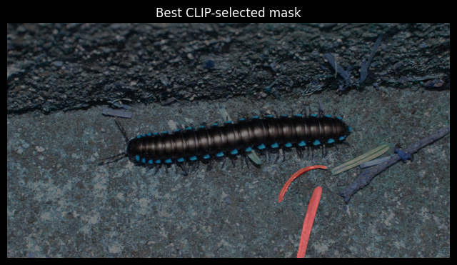
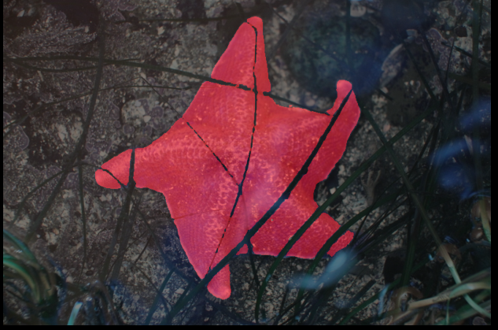
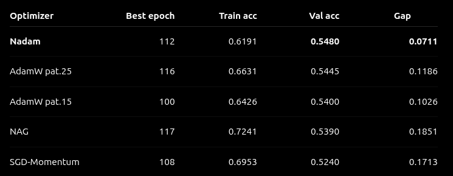

# Initial steps

### March 17

**3pm**  
YOLO for segmentation of the objects:  
- YOLO seems to need annotation of the objects, which I don't have. So, annotating myself is too much work, so I will need to find another model. SAM seems to be a good option, as it does not need annotation.  

Sources:  
https://training.galaxyproject.org/training-material/topics/imaging/tutorials/yolo-segmentation-training/tutorial.html  
https://github.com/facebookresearch/segment-anything

**5pm**  
I've tried around a bit, and indeed: SAM does return segmentation masks quite well. However, there are too many, and it can not tell which one I want. So, the semantics are somehow missing. I've tried to create a score which rewards if an object is centered or not, and give some bonus if it is big. However, the results are quite bad.  
This made me think, and I believe I have found a solution: I should build an animal or fungi classifier first (and say that everything else is plantae? Or how to solve this?). Then I will use SAM to return the x best segmentation masks. I will crop the detected objects from these segmentation masks and feed it to the classifier. The one the classifier approves is taken. With this, I create a new dataset with which I can retrain the model. Then I can compare if it got better or not.  
Another alternative could be to annotate 100 images for YOLO from different instances, so it can detect: Fungi or animal, then apply YOLO to segment the images. Then train the model.

**5:35pm**  
Taking back what I just said: SAM might work by itself without my new plan of classifying the masks first. In this blog post https://blogs.torus.ai/segment-anything/, I found that it actually accepts text prompts. But this is not specified in the GitHub code. So how does it work?

* One thing I found is an open-source library based on SAM: https://github.com/luca-medeiros/lang-segment-anything
* Use CLIP to create a score for each of the segmentation masks. Sources: 
  * Where I found out about CLIP: https://docs.ultralytics.com/guides/similarity-search/#advantages-of-semantic-image-search-with-clip-and-faiss
  * Paper of CLIP: https://arxiv.org/abs/2103.00020
   * Code of CLIP: https://github.com/openai/CLIP

I'll start with CLIP, I guess. This is just to segment the animals from the images. Then, I can train a model from scratch based on the isolated objects. 


### March 18
**8:00am**  
A colleague also told me about U-Net. However, it also needs annotation, so I will ignore it for now. But looking at it, it could do the classification, basically, when I give it the annotation. This is not what I want, as I want to build my own network, but it might be a thing to mention for the state of the art in the paper I'm going to write.  

Sources:  
https://www.sciencedirect.com/science/article/abs/pii/S0031320320303836  
https://stackoverflow.com/questions/62203263/sparse-annotation-in-u-net

** 10:00am**

I've used an image of a seal and water to check how well clip can find the best segmentation masks. On the first sight, it is not so bad. But look below how close the two masks are in terms of similarity (similarity = image_features @ text_features.T). Mask 0 is all the water, mask 1 is the seal. I'm not so much satisfied.

```
Mask 0
          a seal: 30.40%
        a mammal: 26.60%
       an animal: 25.94%
           water: 22.48%
    an amphibian: 22.16%
    
Mask 1
          a seal: 31.37%
        a mammal: 27.87%
       an animal: 27.11%
           water: 22.13%
    an amphibian: 21.88%
```


When I use the softmax function ( (100.0 * similarity).softmax(dim=-1)), the results seem to be better in terms of percentage, but the water is classified as seal:

```
Mask 0 (Ocean)
          a seal: 96.66%
        a mammal: 2.16%
       an animal: 1.11%
           water: 0.03%
    an amphibian: 0.03%
    
Mask 1 (Seal)
          a seal: 95.72%
        a mammal: 2.90%
       an animal: 1.35%
           water: 0.01%
    an amphibian: 0.01%
```

The mask 1 (the seal) still wins, but just by a hair! 

**10:30am**  
In the paper of CLIP, I found the following passage which made me change the prompts as shown below:

```
Another issue we encountered is that it’s relatively rare in
our pre-training dataset for the text paired with the image
to be just a single word. Usually the text is a full sentence
describing the image in some way. To help bridge this
distribution gap, we found that using the prompt template
“A photo of a {label}.” to be a good default that
helps specify the text is about the content of the image. This
often improves performance over the baseline of using only
the label text. For instance, just using this prompt improves
accuracy on ImageNet by 1.3%
```

Now I know why mask 1 of the ocean is so close to a seal: Because I've used bounding boxes, of course the seal is also shown together with the background. So, I need true masking.

However, you could still tell by the shape that it is a seal:

   


And CLIP can tell that, as well:

```
Mask 0 (Ocean)
a photo of a seal: 82.39%
a photo of an animal: 9.36%
a photo of a mammal: 5.16%
a photo of the ocean: 2.46%
a photo of a reptile: 0.24%

Mask 1 (Seal)
a photo of a seal: 93.65%
a photo of a mammal: 3.33%
a photo of an animal: 2.59%
a photo of a reptile: 0.21%
a photo of a person: 0.11%
```

**1:00pm**  
I've tried to destroy the information by randomized morphological dilation of the contour of the other segmentation masks. It increased the accuracy.

```
Mask 0 (Ocean)
a photo of a seal: 66.35%
a photo of an animal: 21.14%
a photo of the ocean: 8.35%
a photo of a mammal: 2.64%
a photo of a reptile: 1.07%

Mask 1 (Seal)
a photo of a seal: 96.70%
a photo of an animal: 1.45%
a photo of a mammal: 1.41%
a photo of a reptile: 0.24%
a photo of the ocean: 0.10%
```


I've also tried it on other images. For the first, it works well and is able to detect the mammal next to a tree that always failed in the previous algorithm:


```
Mask 0
a photo of a reptile: 30.58%
a photo of an animal: 12.18%
a photo of a plant: 11.73%
a photo of an insect: 10.98%
 grass or forest: 6.28%

Mask 1 (mammal)
a photo of a mammal: 90.46%
a photo of an animal: 9.14%
a photo of a person: 0.17%
a photo of a reptile: 0.10%
a photo of a seal: 0.09%
```

For the frog in the hand, the results are as follows (even though it gets detected):

```
Frog mask with morphological dilation::
a photo of an insect: 35.71%
a photo of an animal: 24.74%
a photo of an amphibian: 18.68%
a photo of a frog: 7.25%
a photo of a reptile: 6.88%
```


BUT it gets detected:


Without the morphological dilation, the results are different, and on the first sight better:

```
Frog mask without morphological dilation:
a photo of a reptile: 30.79%
a photo of an amphibian: 25.94%
a photo of a frog: 21.41%
a photo of an animal: 10.63%
a photo of an insect: 9.35%
```

However, the problem is that the background is also classified as a frog, which is not good. So, in comparison, the dilation mask is actually better.

```
Mask of the hand that the frog holds without morphological dilation:
a photo of a person: 21.50%
a photo of a frog: 20.97%
a photo of an amphibian: 14.39%
a photo of an animal: 13.88%
a photo of a mammal: 12.47%
```


Bottom line: I think this could work.


**2pm**  
Spiders are difficult, because the segmentation masks are not perfect. I can probably find a setting with SAM that segments them well.


```
Mask of the background:
a photo of a spider: 77.09%
a photo of an insect: 20.39%
a photo of an amphibian: 0.76%
a photo of an animal: 0.66%
a photo of a frog: 0.61%
```


```
Mask of the spider, but legs are missing
a photo of an insect: 53.22%
a photo of a spider: 19.45%
a photo of an amphibian: 8.73%
a photo of an animal: 5.20%
a photo of a frog: 3.57%
Best score: 0.9935
```

Maybe, in these cases, I can detect this by the image area itself? Or I use a different algorithm for spiders. Or, I only do the fine-tuning for mammals or something where it works well. Or, I use the negative of the result that detects a spider, as the image background always finds the spider, but the segmentation mask itself not. Then, I take the biggest negative object. I think this could work.


Some pictures are also acceptable, because they remove part of the background. The following image of a bird on a tree illustrates this. Here, it is also quite hard to separate the bird from the tree, as they have quite the same color. But SAM actually managed to do so.

Mask with bird and tree:  

```
a photo of a bird: 94.18%
a photo of an animal: 5.34%
a photo of a person: 0.41%
a photo with a tree: 0.02%
a photo with a piece of wood: 0.01%
```

Mask with only the bird:  

```
a photo of a bird: 33.78%
a photo of an animal: 31.94%
a photo of a person: 13.87%
a photo of the ocean: 10.36%
water surface with reflections: 5.69%
```

It could even be better for the CNN as input image to not detect just the bird here!

----------------------

Bottom line: It needs a lot of effort to this segmentation properly, so I should talk to the professor about it, as this is not the main purpose of the project.


# Resizing

### 24. March
* Resizing and zero padding: 
  * Resizing: Total number of parameters in CNN depends on input size. Smaller size: Takes less computational time, less parameters necessary.
    * Should be done by averaging, not by skipping some pixels, to prevent aliasing effects (high freq changes become low freq changes, e.g. changing light and dark colors -> constant dark and light)  
     https://www.baeldung.com/cs/large-images-cnns
  * Zero padding ( https://link.springer.com/article/10.1186/s40537-019-0263-7 ) does not influence the model, because zero values do not update synaptic weights after back propagation (weight of gradient = 0)
* Resize the image to which dimensions?
  * In general, 224x224 is a good standard size (used by e.g. ImageNet)
  *  I did some evaluation over all images and got the following results: 
     * Width - min/median/max: 306 800.0 800 
     * Height - min/median/max: 124 600.0 800 
     * Aspect ratio - min/median/max: 0.3825 1.3333 6.4516
     
     
     
     * So, the dataset is not naturally squared: The median aspect ratio is 1.33, which is also the result if you take the ratio between the median width to height (800/600)
     * Case padding: 256 is a standard size. As we have width/height of 1.33, let's set width to 256, and width to 192.
     * Case cropping: a standard way is to resize the shorter side to 256 pixels, and then crop: https://stackoverflow.com/questions/71341354/cnn-why-do-we-first-resize-the-image-to-256-and-then-center-crop-to-224
       * Disadvantage: You always crop, even if image symmetric.
       * Advantage: You can randomly crop and augment data like this
* Assumption: Kernel does not need to take features from edges into account, because I expect the objects to be more or less centered in the image. The borders shouldn't be so interesting. Therefore, no padding is necessary when applying the Kernel.


### 25. March
I've decided to implement both the padding and the random-center-crop, as I couldn't decide which one will be really better (there is a parameter to switch between the two). I've also visualized many images. From this sample, I'm pretty sure that the random-resized-crop is better. All the images I've seen (around 50) were pretty good with this transformation.  Below is one example. 

I will leave the settings for the random-resized-crop for now as specified below:

```
transforms.RandomResizedCrop(size = IMG_SIZE, # Output size, squared
                                         scale = (0.6, 1.0),  # Scale of image area before cropping
                                         ratio = (0.75, 1.3333333333333333),  # Ratio of image area before cropping
                                         antialias = True),
```


### Exploring Animalia Section

Even easy images are not that easy. Even though I explicitly prompted for the animal here (millipede or centipede), the grass for CLIP looks more like a millipede than the actual millipede:



On the other hand: A starfish worked directly




# Metrics
- Macro-accuracy and macro-recall is almost identical to normal accuracy and normal recall because the classes are perfectly balanced


# Training Plan

### HPC setting
- GPU often blocked, so CPU training also necessary
- CPU: 
  - 1 epoch 550s with 1 worker, 7 CPUs
  - 1 epoch 440s with 4 workers, 7 CPUs
  - With 10 workers and 12 CPUs, nothing changes. So I stick with second one.

### resnet18

```bash
resnet18_frozen_seed42_lr1e-3

if stable:
    resnet18_frozen_seed123_lr1e-3
    resnet18_frozen_seed999_lr1e-3

if unstable:
    resnet18_frozen_seed42_lr3e-4
    then 3 seeds with lr3e-4
```
```bash
run_name,script,model_type,epochs,batch_size,lr,weight_decay,dropout,seed,amp
resnet18_frozen_lr1e3,train_10-class_classifier.py,resnet18,10,32,0.001,0.0001,0.0,42,true
resnet18_frozen_lr3e4,train_10-class_classifier.py,resnet18,10,32,0.0003,0.0001,0.0,42,true
```

- Then do final training.
- The 3 seeds is only to be able to give a +- confidence.


# Runs

## Training Run 1

### Setup
- GPU's are all blocked, so I use CPUs
- Custom model
  - Epochs: 100
  - Time 14h (as one epoch can last 440s)
  - Patience: 10 epochs
  - Dropout: [0.1, 0.3, 0.5]
  - LR with dropout 0.3: [2e-3, 3e-4]

```bash
custom_lr1e3_wd1e4_do01_seed42,train_10-class_classifier.py,custom,100,32,0.001,0.0001,0.1,42,true
custom_lr1e3_wd1e4_do03_seed42,train_10-class_classifier.py,custom,100,32,0.001,0.0001,0.3,42,true
custom_lr1e3_wd1e4_do05_seed42,train_10-class_classifier.py,custom,100,32,0.001,0.0001,0.5,42,true
custom_lr3e4_wd1e4_do03_seed42,train_10-class_classifier.py,custom,100,32,0.0003,0.0001,0.3,42,true
custom_lr2e3_wd1e4_do03_seed42,train_10-class_classifier.py,custom,100,32,0.002,0.0001,0.3,42,true
```

- Resnet18 frozen:
  - Epochs: 50, patience: 10
  - Time: 4h
  - Patience: 5 epochs

```bash
resnet18_frozen_lr1e3_seed42,train_10-class_classifier.py,resnet18,50,32,0.001,0.0001,0.0,42,true
resnet18_frozen_lr3e4_seed42,train_10-class_classifier.py,resnet18,50,32,0.0003,0.0001,0.0,42,true
```

### Results

**Custom model**
- Dropout 0.3, LR 0.0003, GPU:
  - 25s per epoch
  - Early stopping 44, best 34
  - Epoch 34: 
    - train loss 1.4429, acc 0.4889, m-recall 0.4890, m-prec 0.4896
    - val loss 1.5266, acc 0.4825, m-recall 0.4825, m-prec 0.5041
- Dropout 0.3, LR 0.0003, CPU:
  - 780s per epoch
  - Early stopping epoch 58, best 48
  - Epoch 48:
    - train loss 1.2683, acc 0.5527, m-recall 0.5527, m-prec 0.5551
    - val loss 1.4898, acc 0.5055, m-recall 0.5055, m-prec 0.5141
- Dropout 0.3, LR 0.001, GPU, patience 15:
  - 25s per epoch
  - Early stopping 115, best 100
  - Epoch 100:
    - train loss 1.0055, acc 0.6426, m-recall 0.6426, m-prec 0.6442
    - val loss 1.5506, acc 0.5400, m-recall 0.5400, m-prec 0.5478
  - With patience 25, early stopping epoch 141
  - Epoch 116:
    - train loss 0.9353, acc 0.6631, m-recall 0.6631, m-prec 0.6642
    - val loss 1.5198, acc 0.5445, m-recall 0.5445, m-prec 0.5544
  - Improved a bit

- Dropout 0.3, LR 0.002, CPU:
  - TIME LIMIT
  - ~900s per epoch, got until epoch 56
  - Epoch 56:
    - train loss 1.4835, acc 0.4798, m-recall 0.4798, m-prec 0.4810
    - val loss 1.6162, acc 0.4535, m-recall 0.4535, m-prec 0.4832
- Dropout 0.5, LR 0.001:
  - Early stopping epoch 213. 
  - Hard overfit, better after 100 epochs, afterwards overfit.
  - Epoch 183: 
    - train loss 0.4836, acc 0.8364, m-recall 0.8364, m-prec 0.8367
    - val loss 2.1229, acc 0.5200, m-recall 0.5200, m-prec 0.5355
- Dropout 0.1, LR 0.001, CPU:
  - TIME LIMIT, but already looks like overfitting
  - 720s per epoch, got until epoch 66
  - Epoch 66:
    - train loss 1.2233, acc 0.5711, m-recall 0.5711, m-prec 0.5728
    - val loss 1.6789, acc 0.4520, m-recall 0.4520, m-prec 0.4936
- Dropout 0.3, LR 0.001, CPU:
  - TIME LIMIT
  - 780s per epoch, got until epoch 66
  - Epoch 65:
    - train loss 1.3068, acc 0.5463, m-recall 0.5463, m-prec 0.5491
    - val loss 1.5140, acc 0.4915, m-recall 0.4915, m-prec 0.5142
  
**Resnet18 frozen**
  - LR 0.001, CPU, seed 42:
    - 188s per epoch
    - Early stopping 17, best 7
    - Epoch 7: 
      - train loss 0.7912, acc 0.7328, m-recall 0.7328, m-prec 0.7335
      - val loss 0.7133, acc 0.7645, m-recall 0.7645, m-prec 0.7708
  - LR 0.001, seed 123, epoch 30:
    - train loss 0.7353, acc 0.7460, m-recall 0.7460, m-prec 0.7458
    - val loss 0.7429, acc 0.7705, m-recall 0.7705, m-prec 0.7732
  - LR 0.001, seed 999, epoch 12:
    - train loss 0.7519, acc 0.7442, m-recall 0.7442, m-prec 0.7448
    - val loss 0.7292, acc 0.7615, m-recall 0.7615, m-prec 0.7653 
  - LR 0.0003, CPU, seed 42:
    - ~350s/epoch
    - Early stopping epoch 66
    - Epoch 51:
      - train loss 0.7164, acc 0.7607, m-recall 0.7607, m-prec 0.7615
      - val loss 0.7224, acc 0.7715, m-recall 0.7715, m-prec 0.7780


## Training Run 2

- Test different architectures against each other
  - Simple model (1CNN layer only)
  - Simple model + BatchNorm
  - Custom one (2CNN layers) -> Already done before
  - Complex model (like the custom, but adds another block at the end)

```bash
run_name,script,model_type,epochs,batch_size,lr,weight_decay,dropout,seed,amp,patience
simple_lr1e3_do03_seed42,train_10-class_classifier.py,simple,250,32,0.001,0.0001,0.3,42,true,25
simplebn_lr1e3_do03_seed42,train_10-class_classifier.py,simple_batch,250,32,0.001,0.0001,0.3,42,true,25
complex_lr1e3_do04_seed42,train_10-class_classifier.py,complex,400,32,0.001,0.0001,0.3,42,true,25
```

### Results

- Simple, no BatchNorm:
  - Early stopping after 85 epochs, best 60
  - Epoch 60: 
    - train loss 1.0356, acc 0.6270, m-recall 0.6270, m-prec 0.6285 
    - val loss 1.8011, acc 0.4595, m-recall 0.4595, m-prec 0.4695
  
- Simple, with BatchNorm:
  - Early stopping after 218 epochs, best 193! Stabilized training.
  - But after this training, seems like hard overfit
  - Epoch 193:
    - train loss 0.5580, acc 0.8036, m-recall 0.8036, m-prec 0.8037
    - val loss 1.8799, acc 0.5380, m-recall 0.5380, m-prec 0.5394
  - Epoch 113:
    - train loss 0.9398, acc 0.6630, m-recall 0.6630, m-prec 0.6649
    - val loss 1.6624, acc 0.5120, m-recall 0.5120, m-prec 0.5224
  - Epoch 59:
    - train loss 1.3203, acc 0.5357, m-recall 0.5357, m-prec 0.5387
    - val loss 1.5768, acc 0.4820, m-recall 0.4820, m-prec 0.5003 
  - I'd say overfitting after epoch 60.
  - BUT: Compared to noBatchnorm, the metrics are a bit better at around epoch 60. And also, less overfitting (less gap). Without BatchNorm, the simple model already overfits earlier.

- Custom (copy-paste from previous experiment):
  - Dropout 0.3, LR 0.001, GPU, patience 15:
    - Early stopping 115, best 100
    - Epoch 100:
      - train loss 1.0055, acc 0.6426, m-recall 0.6426, m-prec 0.6442
      - val loss 1.5506, acc 0.5400, m-recall 0.5400, m-prec 0.5478
  - With patience 25, early stopping epoch 141
    - Epoch 116:
      - train loss 0.9353, acc 0.6631, m-recall 0.6631, m-prec 0.6642
      - val loss 1.5198, acc 0.5445, m-recall 0.5445, m-prec 0.5544
  - Better accuracy and less overfitting gap compared to simple model

- Complex:
  - Early stopping epoch 125, best 100
  - Epoch 100:
    - train loss 0.8454, acc 0.7047, m-recall 0.7047, m-prec 0.7056
    - val loss 1.5449, acc 0.5365, m-recall 0.5365, m-prec 0.5471
  - Epoch 92:
    - train loss 0.9817, acc 0.6542, m-recall 0.6542, m-prec 0.6578
    - val loss 1.5512, acc 0.5255, m-recall 0.5255, m-prec 0.5378


Conclusions:
- BatchNorm > no BatchNorm
- Custom > Complex
- Custom > Simple


# Training Run 3

- Custom clear winner.
- Image augmentation
- We see quite some overfitting:
  - More regularization (weight decay, as already tried dropout)
  - [3e-4, 5e-4, 1e-3]
- Different optimizers
  - https://pmc.ncbi.nlm.nih.gov/articles/PMC8321140/  this paper suggests some optimizers. Based on this, I'll try Nadam optimizer.
  - According to paper RMSProp and Adamax poor performance
  - It also says that all optimizers had about same performance if optimal hyperparas were chosen
    - AdamW
    - Nadam
      - "Table 4 shows the results for the ResNet architecture, which shows that the best AUC was achieved by the Nadam optimizer."
    - SGD + Momentum
      - https://apxml.com/courses/deep-learning-regularization-optimization/chapter-6-adaptive-optimizers/choosing-optimizers-guidelines
      - For tasks where architectures and hyperparameters are well-understood (like standard image classification benchmarks), tuned SGD+Momentum often achieves excellent results
    - NAG
      - Paper: "Overall, NAG optimizer did achieve high results overall the four architectures and overall the three learning rates used with the medium learning rate (1×10−4) achieved the best results"
- Skip connections

Augmentation
```bash
run_name,script,model_type,epochs,batch_size,lr,weight_decay,dropout,seed,amp,patience,optimizer,aug
custom_squarepad_wd1e4,train_10-class_classifier.py,custom,250,32,0.001,0.0001,0.3,42,true,25,adamw,square_pad
```

Skip Connection
```bash
run_name,script,model_type,epochs,batch_size,lr,weight_decay,dropout,seed,amp,patience,optimizer,aug
custom_residual_wd1e4,train_10-class_classifier.py,custom_residual,250,32,0.001,0.0001,0.3,42,true,25,adamw,random_resized_crop
```

Regularization
```bash
run_name,script,model_type,epochs,batch_size,lr,weight_decay,dropout,seed,amp,patience,optimizer,aug
custom_wd3e4,train_10-class_classifier.py,custom,250,32,0.001,0.0003,0.3,42,true,25,adamw,random_resized_crop
custom_wd5e4,train_10-class_classifier.py,custom,250,32,0.001,0.0005,0.3,42,true,25,adamw,random_resized_crop
custom_wd1e3,train_10-class_classifier.py,custom,250,32,0.001,0.001,0.3,42,true,25,adamw,random_resized_crop
```

Optimizers
```bash
run_name,script,model_type,epochs,batch_size,lr,weight_decay,dropout,seed,amp,patience,optimizer,aug
custom_nadam,train_10-class_classifier.py,custom,250,32,0.001,0.0001,0.3,42,true,25,nadam,random_resized_crop
custom_sgd_momentum,train_10-class_classifier.py,custom,250,32,0.01,0.0001,0.3,42,true,25,sgd_momentum,random_resized_crop
custom_nag,train_10-class_classifier.py,custom,250,32,0.01,0.0001,0.3,42,true,25,nag,random_resized_crop
```

## Results

### Augmentation
- SquarePad
  - Early stopping 134, best 109
  - Epoch 109:
    - train loss 0.3264, acc 0.8866, m-recall 0.8866, m-prec 0.8869
    - val loss 3.2083, acc 0.4480, m-recall 0.4480, m-prec 0.4662
  - Epoch 72:
    - train loss 1.1223, acc 0.5971, m-recall 0.5971, m-prec 0.5998
    - val loss 1.6559, acc 0.4385, m-recall 0.4385, m-prec 0.4665

- RandomResizedCrop (copy-paste from previous experiment):
  - Patience 15:
    - Early stopping 115, best 100
    - Epoch 100:
      - train loss 1.0055, acc 0.6426, m-recall 0.6426, m-prec 0.6442
      - val loss 1.5506, acc 0.5400, m-recall 0.5400, m-prec 0.5478
  - Patience 25, early stopping epoch 141
    - Epoch 116:
      - train loss 0.9353, acc 0.6631, m-recall 0.6631, m-prec 0.6642
      - val loss 1.5198, acc 0.5445, m-recall 0.5445, m-prec 0.5544

=> SquarePad overfits hard and also gives less accuracy. It shows that preprocessing plays a role.

### Skip Connections

- Skip connections:
  - Early stopping epoch 127, best 102
  - Epoch 102:
    - train loss 0.6952, acc 0.7556, m-recall 0.7556, m-prec 0.7570
    - val loss 1.8046, acc 0.5500, m-recall 0.5500, m-prec 0.5537
  - Epoch 72:
    - train loss 1.0142, acc 0.6412, m-recall 0.6412, m-prec 0.6428
    - val loss 1.4690, acc 0.5365, m-recall 0.5365, m-prec 0.5408

- No skip connections:
  - Patience 15:
    - Early stopping 115, best 100
    - Epoch 100:
      - train loss 1.0055, acc 0.6426, m-recall 0.6426, m-prec 0.6442
      - val loss 1.5506, acc 0.5400, m-recall 0.5400, m-prec 0.5478
  - Patience 25, early stopping epoch 141
    - Epoch 116:
      - train loss 0.9353, acc 0.6631, m-recall 0.6631, m-prec 0.6642
      - val loss 1.5198, acc 0.5445, m-recall 0.5445, m-prec 0.5544

### Optimizers
- Nadam
  - Early stopping after 137, best 112
  - Epoch 112:
    - train loss 1.0764, acc 0.6191, m-recall 0.6191, m-prec 0.6197
    - val loss 1.4019, acc 0.5480, m-recall 0.5480, m-prec 0.5586
- SGD-Momentum
  - Early stopping after epoch 133, best 108
  - Epoch 108:
    - train loss 0.8788, acc 0.6953, m-recall 0.6953, m-prec 0.6969
    - val loss 1.5783, acc 0.5240, m-recall 0.5240, m-prec 0.5402
- NAG
  - Early stopping after epoch 142, best 117
  - Epoch 117:
    - train loss 0.7953, acc 0.7241, m-recall 0.7241, m-prec 0.7252
    - val loss 1.5658, acc 0.5390, m-recall 0.5390, m-prec 0.5476
- AdamW (copy-paste from previous experiment):
  - Patience 15:
    - Early stopping 115, best 100
    - Epoch 100:
      - train loss 1.0055, acc 0.6426, m-recall 0.6426, m-prec 0.6442
      - val loss 1.5506, acc 0.5400, m-recall 0.5400, m-prec 0.5478
  - Patience 25, early stopping epoch 141
    - Epoch 116:
      - train loss 0.9353, acc 0.6631, m-recall 0.6631, m-prec 0.6642
      - val loss 1.5198, acc 0.5445, m-recall 0.5445, m-prec 0.5544


=> Nadam best optimizer (less overfitting), AdamW still competitive, NAG and SGD-Momentum overfit harder.


### Regularization
- Weight decay 0.0001 (copy-paste from previous experiment):
  - Patience 15:
    - Early stopping 115, best 100
    - Epoch 100:
      - train loss 1.0055, acc 0.6426, m-recall 0.6426, m-prec 0.6442
      - val loss 1.5506, acc 0.5400, m-recall 0.5400, m-prec 0.5478
  - Patience 25, early stopping epoch 141
    - Epoch 116:
      - train loss 0.9353, acc 0.6631, m-recall 0.6631, m-prec 0.6642
      - val loss 1.5198, acc 0.5445, m-recall 0.5445, m-prec 0.5544
- Weight decay 0.0003
  - Early stopping 147, best 122
  - Epoch 122:
    - train loss 0.8585, acc 0.6996, m-recall 0.6996, m-prec 0.7013
    - val loss 1.5796, acc 0.5505, m-recall 0.5505, m-prec 0.5567
- Weight decay 0.0005
  - Early stopping 159, best 134
  - Epoch 134:
    - train loss 0.7637, acc 0.7330, m-recall 0.7330, m-prec 0.7342
    - val loss 1.6159, acc 0.5465, m-recall 0.5465, m-prec 0.5537
- Weight decay 0.001
  - Early stopping 151, best 126
  - Epoch 126:
    - train loss 0.7924, acc 0.7225, m-recall 0.7225, m-prec 0.7236
    - val loss 1.5866, acc 0.5515, m-recall 0.5515, m-prec 0.5604

=> More regularization seems to stabilize training.

# Training Run 4
- Inception layer
```bash
run_name,script,model_type,epochs,batch_size,lr,weight_decay,dropout,seed,amp,patience,optimizer,aug
simple_inception,train_10-class_classifier.py,simple_inception,250,32,0.001,0.0001,0.3,42,true,25,adamw,random_resized_crop
complex_inception,train_10-class_classifier.py,complex_inception,250,32,0.001,0.0001,0.3,42,true,25,adamw,random_resized_crop 
```
- Nadam + Skip connections, weight decay 0.001
```bash
run_name,script,model_type,epochs,batch_size,lr,weight_decay,dropout,seed,amp,patience,optimizer,aug
custom_residual_nadam_wd1e3_rrc,train_10-class_classifier.py,custom_residual,350,32,0.001,0.001,0.3,42,true,20,nadam,random_resized_crop 
```

## Results

### Inception Layer
- Baseline (copy-paste from previous experiment):
  - Patience 15, epoch 100:
      - train loss 1.0055, acc 0.6426, m-recall 0.6426, m-prec 0.6442
      - val loss 1.5506, acc 0.5400, m-recall 0.5400, m-prec 0.5478
  - Patience 25, epoch 116:
      - train loss 0.9353, acc 0.6631, m-recall 0.6631, m-prec 0.6642
      - val loss 1.5198, acc 0.5445, m-recall 0.5445, m-prec 0.5544
- Simple inception
  - Best 131:
    - train loss 0.6805, acc 0.7607, m-recall 0.7607, m-prec 0.7614
    - val loss 1.8328, acc 0.5530, m-recall 0.5530, m-prec 0.5616 
  - Epoch 117:
    - train loss 0.7802, acc 0.7213, m-recall 0.7214, m-prec 0.7237
    - val loss 1.6616, acc 0.5410, m-recall 0.5410, m-prec 0.5702
- Simple inception again:
  - Best 136:
    - train loss 0.6404, acc 0.7815, m-recall 0.7815, m-prec 0.7821
    - val loss 1.8624, acc 0.5530, m-recall 0.5530, m-prec 0.5623
  - Epoch 104:
    - train loss 0.8656, acc 0.6977, m-recall 0.6977, m-prec 0.6997 
    - val loss 1.5174, acc 0.5405, m-recall 0.5405, m-prec 0.5441
- Complex inception:
  - Best 92:
    - train loss 0.4340, acc 0.8482, m-recall 0.8482, m-prec 0.8486
    - val loss 1.8813, acc 0.5680, m-recall 0.5680, m-prec 0.5690
  - Epoch 60:
    - train loss 0.8315, acc 0.7101, m-recall 0.7101, m-prec 0.7108
    - val loss 1.4638, acc 0.5620, m-recall 0.5620, m-prec 0.5633

### Nadam + Skip connections, weight decay 0.001
- Custom one: Really bad. Best epoch 97:
  - train loss 1.5824, acc 0.4502, m-recall 0.4502, m-prec 0.4488
  - val loss 1.6328, acc 0.4470, m-recall 0.4470, m-prec 0.4775
- Simple inception: 
  - Best 32: 
    - train loss 1.7828, acc 0.3607, m-recall 0.3607, m-prec 0.3548
    - val loss 1.7663, acc 0.3915, m-recall 0.3915, m-prec 0.3907
- Complex inception:
  - Best 80:
    - train loss 1.5299, acc 0.4664, m-recall 0.4664, m-prec 0.4644
    - val loss 1.5524, acc 0.4710, m-recall 0.4710, m-prec 0.4903
=> Overall not so good!


- Hyperpar optimization with Optuna


# Segmentation Training
- Just save the masks (less storage)
- Different variants of how to apply
  - Just segmented object, rest white, cropped to object
  - Cut off object in image, as a form of random image augmentation. We can add randomness. And then 50% segmented images, 50% normal ones.

- I expect the model to get worse in areas like reptiles. It could get better for e.g. birds or mammals, though.