### March 17

**3pm**  
YOLO for segmentation of the objects:  
- YOLO seems to need annotation of the objects, which I don't have. So, annotating myself is too much work, so I will need to find another model. SAM seems to be a good option, as it does not need annotation.  

Sources:  
https://training.galaxyproject.org/training-material/topics/imaging/tutorials/yolo-segmentation-training/tutorial.html  
https://github.com/facebookresearch/segment-anything

**5pm**  
I've tried around a bit, and indeed: SAM does return segmentation masks quite well. However, there are too many, and it can not tell which one I want. So, the semantics are somehow missing. I've tried to create a score which rewards if an object is centered or not, and give some bonus if it is big. However, the results are quite bad.  
This made me think, and I believe I have found a solution: I should build an animal or fungi classifier first (and say that everything else is plantae? Or how to solve this?). Then I will use SAM to return the x best segmentation masks. I will crop the detected objects from these segmentation masks and feed it to the classifier. The one the classifier approves is taken. With this, I create a new dataset with which I can retrain the model. Then I can compare if it got better or not.  
Another alternative could be to annotate 100 images for YOLO from different instances, so it can detect: Fungi or animal, then apply YOLO to segment the images. Then train the model.

**5:35pm**  
Taking back what I just said: SAM might work by itself without my new plan of classifying the masks first. In this blog post https://blogs.torus.ai/segment-anything/, I found that it actually accepts text prompts. But this is not specified in the GitHub code. So how does it work?

* One thing I found is an open-source library based on SAM: https://github.com/luca-medeiros/lang-segment-anything
* Use CLIP to create a score for each of the segmentation masks. Sources: 
  * Where I found out about CLIP: https://docs.ultralytics.com/guides/similarity-search/#advantages-of-semantic-image-search-with-clip-and-faiss
  * Paper of CLIP: https://arxiv.org/abs/2103.00020
   * Code of CLIP: https://github.com/openai/CLIP

I'll start with CLIP, I guess. This is just to segment the animals from the images. Then, I can train a model from scratch based on the isolated objects. 


### March 18
**8:00am**  
A colleague also told me about U-Net. However, it also needs annotation, so I will ignore it for now. But looking at it, it could do the classification, basically, when I give it the annotation. This is not what I want, as I want to build my own network, but it might be a thing to mention for the state of the art in the paper I'm going to write.  

Sources:  
https://www.sciencedirect.com/science/article/abs/pii/S0031320320303836  
https://stackoverflow.com/questions/62203263/sparse-annotation-in-u-net

** 10:00am**

I've used an image of a seal and water to check how well clip can find the best segmentation masks. On the first sight, it is not so bad. But look below how close the two masks are in terms of similarity (similarity = image_features @ text_features.T). Mask 0 is all the water, mask 1 is the seal. I'm not so much satisfied.

```
Mask 0
          a seal: 30.40%
        a mammal: 26.60%
       an animal: 25.94%
           water: 22.48%
    an amphibian: 22.16%
    
Mask 1
          a seal: 31.37%
        a mammal: 27.87%
       an animal: 27.11%
           water: 22.13%
    an amphibian: 21.88%
```

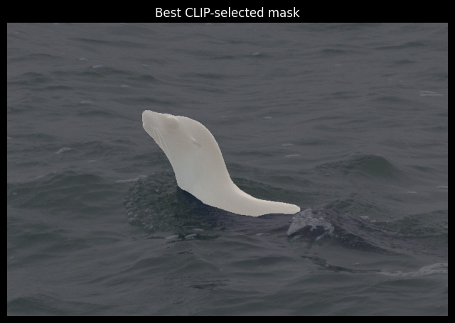

When I use the softmax function ( (100.0 * similarity).softmax(dim=-1)), the results seem to be better in terms of percentage, but the water is classified as seal:

```
Mask 0 (Ocean)
          a seal: 96.66%
        a mammal: 2.16%
       an animal: 1.11%
           water: 0.03%
    an amphibian: 0.03%
    
Mask 1 (Seal)
          a seal: 95.72%
        a mammal: 2.90%
       an animal: 1.35%
           water: 0.01%
    an amphibian: 0.01%
```

The mask 1 (the seal) still wins, but just by a hair! 

**10:30am**  
In the paper of CLIP, I found the following passage which made me change the prompts as shown below:

```
Another issue we encountered is that it’s relatively rare in
our pre-training dataset for the text paired with the image
to be just a single word. Usually the text is a full sentence
describing the image in some way. To help bridge this
distribution gap, we found that using the prompt template
“A photo of a {label}.” to be a good default that
helps specify the text is about the content of the image. This
often improves performance over the baseline of using only
the label text. For instance, just using this prompt improves
accuracy on ImageNet by 1.3%
```

Now I know why mask 1 of the ocean is so close to a seal: Because I've used bounding boxes, of course the seal is also shown together with the background. So, I need true masking.

However, you could still tell by the shape that it is a seal:

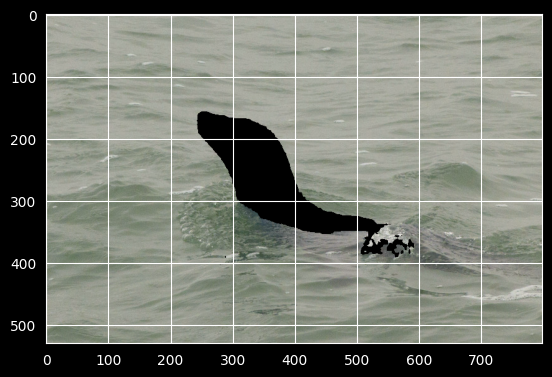   
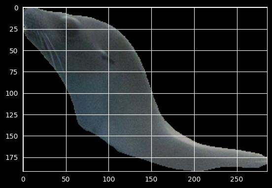

And CLIP can tell that, as well:

```
Mask 0 (Ocean)
a photo of a seal: 82.39%
a photo of an animal: 9.36%
a photo of a mammal: 5.16%
a photo of the ocean: 2.46%
a photo of a reptile: 0.24%

Mask 1 (Seal)
a photo of a seal: 93.65%
a photo of a mammal: 3.33%
a photo of an animal: 2.59%
a photo of a reptile: 0.21%
a photo of a person: 0.11%
```

**1:00pm**  
I've tried to destroy the information by randomized morphological dilation of the contour of the other segmentation masks. It increased the accuracy.

```
Mask 0 (Ocean)
a photo of a seal: 66.35%
a photo of an animal: 21.14%
a photo of the ocean: 8.35%
a photo of a mammal: 2.64%
a photo of a reptile: 1.07%

Mask 1 (Seal)
a photo of a seal: 96.70%
a photo of an animal: 1.45%
a photo of a mammal: 1.41%
a photo of a reptile: 0.24%
a photo of the ocean: 0.10%
```

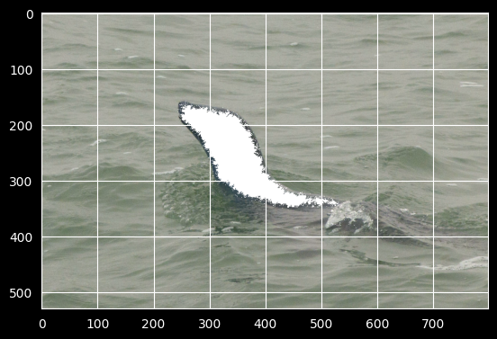

I've also tried it on other images. For the first, it works well and is able to detect the mammal next to a tree that always failed in the previous algorithm:

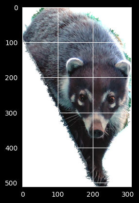

```
Mask 0
a photo of a reptile: 30.58%
a photo of an animal: 12.18%
a photo of a plant: 11.73%
a photo of an insect: 10.98%
 grass or forest: 6.28%

Mask 1 (mammal)
a photo of a mammal: 90.46%
a photo of an animal: 9.14%
a photo of a person: 0.17%
a photo of a reptile: 0.10%
a photo of a seal: 0.09%
```

For the frog in the hand, the results are as follows (even though it gets detected):

```
Frog mask with morphological dilation::
a photo of an insect: 35.71%
a photo of an animal: 24.74%
a photo of an amphibian: 18.68%
a photo of a frog: 7.25%
a photo of a reptile: 6.88%
```
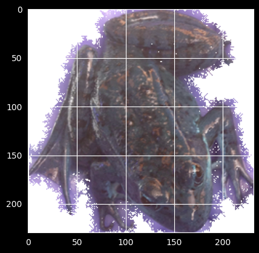

BUT it gets detected:

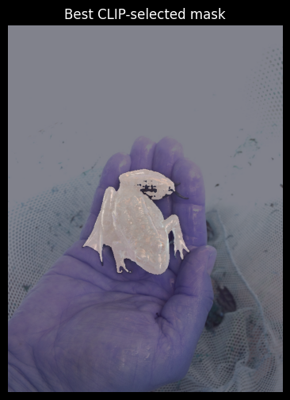

Without the morphological dilation, the results are different, and on the first sight better:

```
Frog mask without morphological dilation:
a photo of a reptile: 30.79%
a photo of an amphibian: 25.94%
a photo of a frog: 21.41%
a photo of an animal: 10.63%
a photo of an insect: 9.35%
```

However, the problem is that the background is also classified as a frog, which is not good. So, in comparison, the dilation mask is actually better.

```
Mask of the hand that the frog holds without morphological dilation:
a photo of a person: 21.50%
a photo of a frog: 20.97%
a photo of an amphibian: 14.39%
a photo of an animal: 13.88%
a photo of a mammal: 12.47%
```

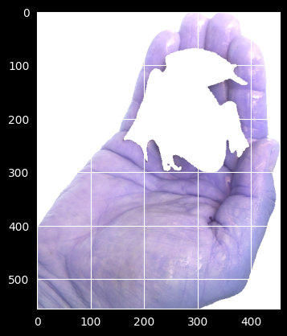

Bottom line: I think this could work.


**2pm**  
Spiders are difficult, because the segmentation masks are not perfect. I can probably find a setting with SAM that segments them well.

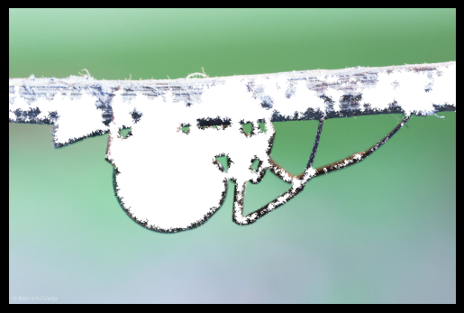
```
Mask of the background:
a photo of a spider: 77.09%
a photo of an insect: 20.39%
a photo of an amphibian: 0.76%
a photo of an animal: 0.66%
a photo of a frog: 0.61%
```

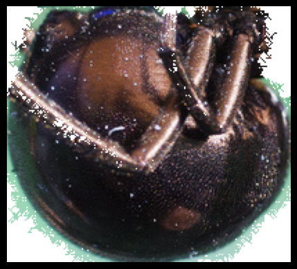
```
Mask of the spider, but legs are missing
a photo of an insect: 53.22%
a photo of a spider: 19.45%
a photo of an amphibian: 8.73%
a photo of an animal: 5.20%
a photo of a frog: 3.57%
Best score: 0.9935
```

Maybe, in these cases, I can detect this by the image area itself? Or I use a different algorithm for spiders. Or, I only do the fine-tuning for mammals or something where it works well. Or, I use the negative of the result that detects a spider, as the image background always finds the spider, but the segmentation mask itself not. Then, I take the biggest negative object. I think this could work.

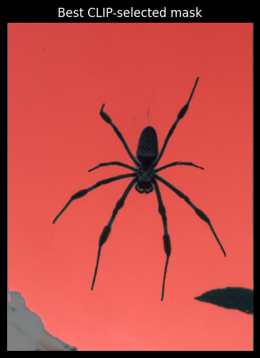

Some pictures are also acceptable, because they remove part of the background. The following image of a bird on a tree illustrates this. Here, it is also quite hard to separate the bird from the tree, as they have quite the same color. But SAM actually managed to do so.

Mask with bird and tree:  
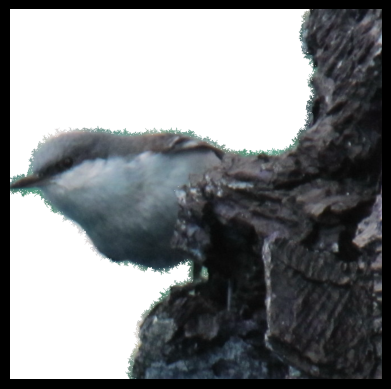
```
a photo of a bird: 94.18%
a photo of an animal: 5.34%
a photo of a person: 0.41%
a photo with a tree: 0.02%
a photo with a piece of wood: 0.01%
```

Mask with only the bird:  
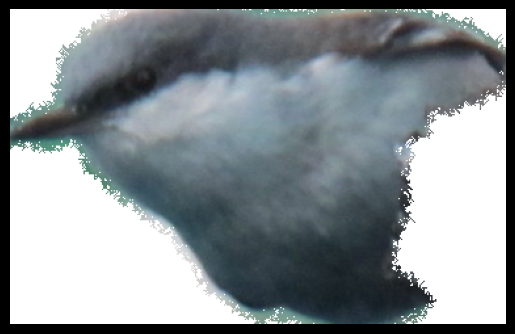
```
a photo of a bird: 33.78%
a photo of an animal: 31.94%
a photo of a person: 13.87%
a photo of the ocean: 10.36%
water surface with reflections: 5.69%
```

It could even be better for the CNN as input image to not detect just the bird here!

----------------------

Bottom line: It needs a lot of effort to this segmentation properly, so I should talk to the professor about it, as this is not the main purpose of the project.


# Resizing

### 24. March
* Resizing and zero padding: 
  * Resizing: Total number of parameters in CNN depends on input size. Smaller size: Takes less computational time, less parameters necessary.
    * Should be done by averaging, not by skipping some pixels, to prevent aliasing effects (high freq changes become low freq changes, e.g. changing light and dark colors -> constant dark and light)  
     https://www.baeldung.com/cs/large-images-cnns
  * Zero padding ( https://link.springer.com/article/10.1186/s40537-019-0263-7 ) does not influence the model, because zero values do not update synaptic weights after back propagation (weight of gradient = 0)
* Resize the image to which dimensions?
  * In general, 224x224 is a good standard size (used by e.g. ImageNet)
  *  I did some evaluation over all images and got the following results: 
     * Width - min/median/max: 306 800.0 800 
     * Height - min/median/max: 124 600.0 800 
     * Aspect ratio - min/median/max: 0.3825 1.3333 6.4516
     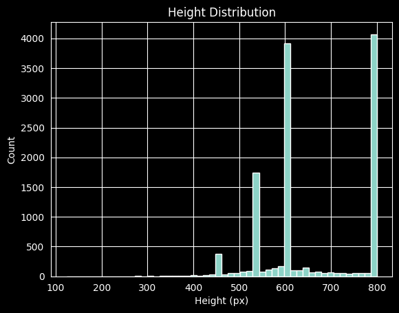
     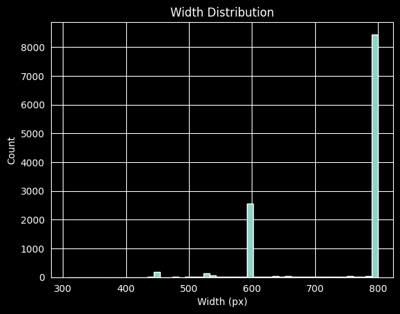
     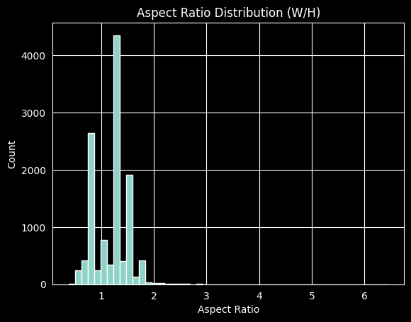
     * So, the dataset is not naturally squared: The median aspect ratio is 1.33, which is also the result if you take the ratio between the median width to height (800/600)
     * Case padding: 256 is a standard size. As we have width/height of 1.33, let's set width to 256, and width to 192.
     * Case cropping: a standard way is to resize the shorter side to 256 pixels, and then crop: https://stackoverflow.com/questions/71341354/cnn-why-do-we-first-resize-the-image-to-256-and-then-center-crop-to-224
       * Disadvantage: You always crop, even if image symmetric.
       * Advantage: You can randomly crop and augment data like this
* Assumption: Kernel does not need to take features from edges into account, because I expect the objects to be more or less centered in the image. The borders shouldn't be so interesting. Therefore, no padding is necessary when applying the Kernel.


### 25. March
I've decided to implement both the padding and the random-center-crop, as I couldn't decide which one will be really better (there is a parameter to switch between the two). I've also visualized many images. From this sample, I'm pretty sure that the random-resized-crop is better. All the images I've seen (around 50) were pretty good with this transformation.  Below is one example. 

I will leave the settings for the random-resized-crop for now as specified below:

```
transforms.RandomResizedCrop(size = IMG_SIZE, # Output size, squared
                                         scale = (0.6, 1.0),  # Scale of image area before cropping
                                         ratio = (0.75, 1.3333333333333333),  # Ratio of image area before cropping
                                         antialias = True),
```
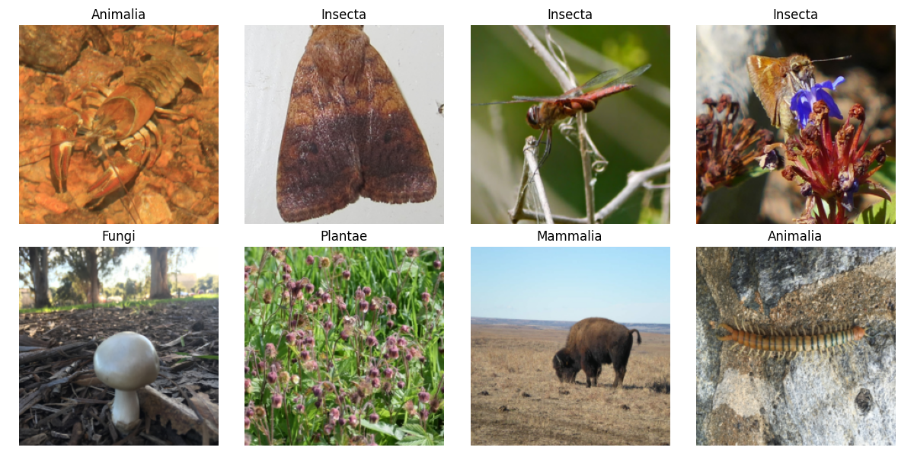